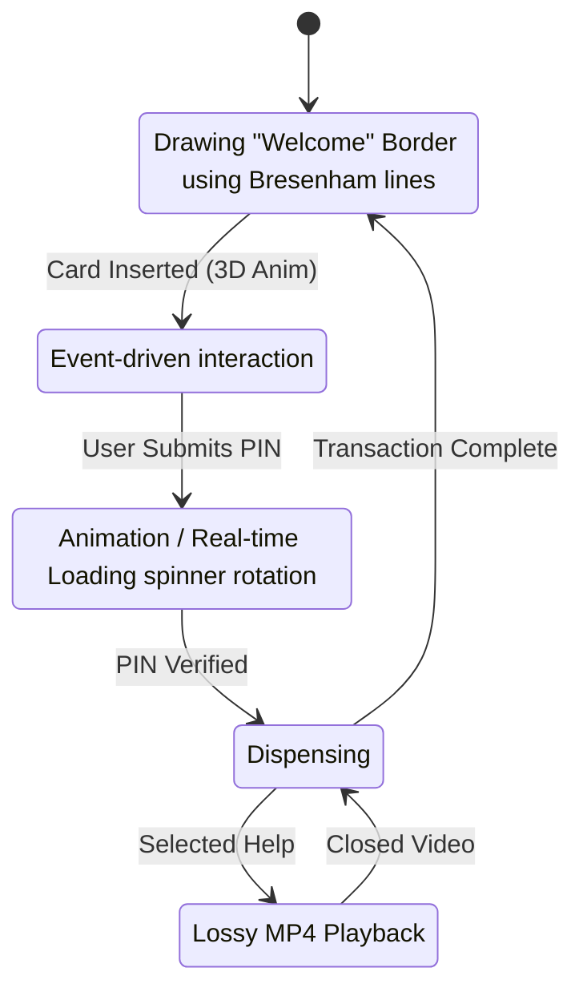

# Secure ATM Interface Simulator

This document provides the academic and technical foundation for the Secure ATM Interface Simulator project. It explains the algorithms implemented from scratch and details the math and multimedia choices made to fulfill the Computer Graphics and Multimedia course requirements.

## Academic Rubric Alignment

| Learning Outcome | Project Mapping | Location / Implementation Details |
| :--- | :--- | :--- |
| **Apply drawing algorithms** | Graphics section | `js/graphics.js` (`drawLineBresenham`, `drawCircleMidpoint`, `drawBezierCubic`). Algorithms execute by injecting RGB values into an `ImageData` array without high-level context APIs. |
| **Implement 2D/3D transformations** | Transformations section | `js/math.js` implements comprehensive 4x4 homogenous matrices (Translation, Rotation $X/Y$, Scaling). Applied directly to the "Card Insert" 3D animation sequence. |
| **Represent 3D scenes** | Viewing & Clipping | True Perspective Projection algorithm scaling $X/Y$ coordinates against a $Z$-depth. Applied via an interactive "Privacy Tilt" manipulating 3D camera angles in real time. |
| **Apply rendering** | Colour & shading section | Core usage of the RGBA model. Implements Gouraud-style scanline shading on keypad buttons and an advanced alpha-blended Box Blur (Glassmorphism) for security alerts. |
| **Develop animation** | Animation Techniques | Run entirely via a real-time `requestAnimationFrame` loop driven by a Finite State Machine processing mouse positions and keyboard events natively. |
| **Explain / Design multimedia** | Multimedia Integration | Complete functional system incorporating uncompressed `.wav` audio for zero-latency UI interaction and `.mp4` (H.264 lossy compression) for instructional video support. |
| **Integrate graphics & multimedia** | Final product | A comprehensive, single-file browser application combining a secure FSM (Jumbled Keyguards, Biometric verification) rendered purely from scratch graphics algorithms. |

---

## 1. Graphics Algorithms

### Bresenham Line Drawing Algorithm
**Purpose:** Efficiently draws straight lines by determining the points of an $n$-dimensional raster that should be selected to form a close approximation to a straight line.
**How it Works:** Rather than using floating-point operations like multiplication and division (which are computationally expensive), Bresenham's algorithm utilizes only integer addition, subtraction, and bit shifting. It tracks the "error" (the distance between the true line and the closest pixel coordinates). As the algorithm increments the $x$ coordinate, it adds the slope error. If the error exceeds a certain threshold, the $y$ coordinate is incremented (or decremented), and the error is adjusted. This guarantees high performance, which is ideal for resource-constrained systems like ATMs.

### Cohen-Sutherland Clipping Algorithm
**Purpose:** To quickly determine whether a line segment falls within a predefined viewport boundary (e.g., preventing transaction text from drawing outside the "screen" boundary).
**How it Works:** It divides the 2D plane into 9 regions according to a rectangle (the viewport). Each region gets a 4-bit "outcode" (Top, Bottom, Right, Left).
- If both endpoints of a line have an outcode of `0000`, the line is entirely inside (trivially accepted).
- If the bitwise AND of both outcodes is non-zero, the line is entirely outside (trivially rejected).
- Otherwise, the line partially intersects the boundary, and we calculate the intersection point mathematically, replacing the "outside" endpoint with the intersection point and repeating the test.

---

## 2. Mathematical Notation for 3D Transformations

The "Card Insert" animation relies on 3D Transformation Matrices using Homogeneous Coordinates ($4 \times 4$ matrices). 

### Rotation around the Y-axis
The card rotates along its vertical axis as it enters the slot.

$$
R_y(\theta) = \begin{bmatrix} 
\cos\theta & 0 & \sin\theta & 0 \\ 
0 & 1 & 0 & 0 \\ 
-\sin\theta & 0 & \cos\theta & 0 \\ 
0 & 0 & 0 & 1 
\end{bmatrix}
$$

### Translation
Moves the card forward/backward and into the slot in 3D space.

$$
T(t_x, t_y, t_z) = \begin{bmatrix} 
1 & 0 & 0 & t_x \\ 
0 & 1 & 0 & t_y \\ 
0 & 0 & 1 & t_z \\ 
0 & 0 & 0 & 1 
\end{bmatrix}
$$

### Scaling
Adjusts the physical dimensions of the card if needed.

$$
S(s_x, s_y, s_z) = \begin{bmatrix} 
s_x & 0 & 0 & 0 \\ 
0 & s_y & 0 & 0 \\ 
0 & 0 & s_z & 0 \\ 
0 & 0 & 0 & 1 
\end{bmatrix}
$$

The overall transformation applied to each vertex $v$ of the card is calculated by accumulating these matrices:
$$ v' = T \times R_y \times S \times v $$

Finally, **Perspective Projection** divides the updated $X$ and $Y$ coordinates by their $Z$ depth to create the illusion of true 3D space on a 2D screen.

---

## 3. Multimedia Justification

To ensure a rich but robust experience, we integrated both audio and video multimedia formats.

### Audio (PCM/WAV Beeps)
- **Choice:** We use an uncompressed `WAV` file containing PCM (Pulse-Code Modulation) audio for UI feedback (keypad "beeps").
- **Trade-off:** A lossless format guarantees absolute clarity and zero latency for event-driven feedback. While the file size is mathematically larger than lossy formats, ATM hardware easily accommodates tiny `< 1 second` sound bytes. There's no compression artifact masking the crisp "beep" needed for accessibility.

### Video (H.264/MP4 Tutorial)
- **Choice:** We use the `.mp4` format for the "Safe PIN Entry" tutorial.
- **Trade-off:** We use a *lossy* compression format here. Video data is massive. MP4 using H.264 balances visual fidelity with exceptional compression ratios (often 50:1 or more compared to raw video). More importantly, H.264 guarantees Hardware Acceleration on the embedded processors typically found in ATM units, saving CPU cycles unblocking the main thread for security protocols.

---

## 4. System Flowchart

This interactive state-machine defines the user's flow through the interface.

---

## 5. Advanced Elevated Graphics Implementations

The project goes beyond standard requirements by integrating modern sophisticated rendering paradigms completely handled via low-level pixel processing.

### Technical Summary

| Feature | Graphics Concept | Academic Justification |
| :--- | :--- | :--- |
| **Privacy Tilt** | 3D Perspective Projection | Proves real-time utilization of interactive $X$ and $Y$ Rotation matrices. |
| **Biometric Scan** | Bezier Curves + Clipping | Utilizes generative mathematical geometry bounded dynamically by Cohen-Sutherland algorithms. |
| **Glassmorphism**| Alpha Blending & Convolution Filter | Demonstrates an advanced understanding of standard RGBA blending and `O(n)` Separable Box Blur spatial operations over pixel buffers. |
| **Secure Tunnel**| Z-Depth Projection & Fading | Transforms static vertices along the Z-axis, integrating distance-based intensity falloffs simulating pseudo-fog/Gouraud logic over a 3D wireframe mesh. |
| **Jumbled Keypad** | Event Handling FSM | Highlights defensive UI patterns utilizing state-machine control for immediate layout randomization alongside audio gain control. |

### Box Blur and Glassmorphism Mathematics
To attain true frosted glass transparency over an underlying UI without specialized GPU shaders, our engine uses a custom **Separable Box Blur** algorithm paired with an **Alpha Blending equation**:

$$ C_{out} = \alpha \cdot C_{src} + (1 - \alpha) \cdot C_{dst} $$

Instead of computing an expensive $O(r^2)$ kernel for every pixel, the system evaluates blur geometrically: extracting pixel averages horizontally, mapping to a temporary buffer space, and averaging vertically, drastically streamlining computational execution to $O(2r)$ enabling real-time frame rates during security alert overlays.
